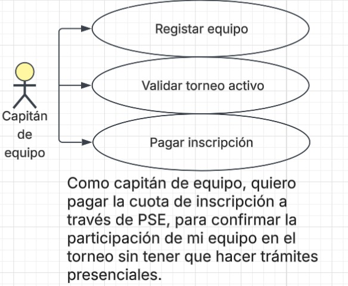
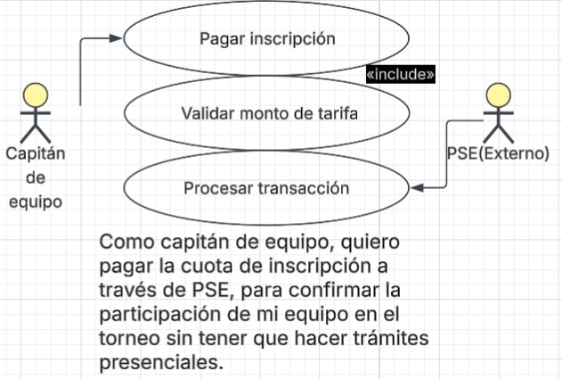
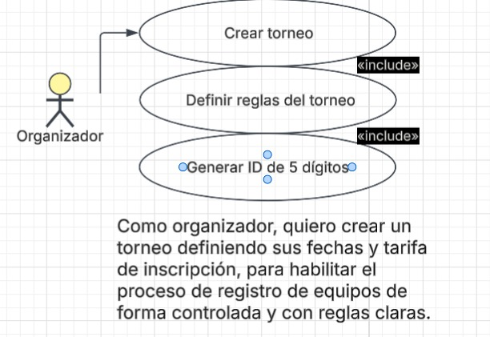

# Requerimientos del Sistema

## 1. Lista General de Requerimientos

El sistema TechCup tiene los siguientes requerimientos (descripción a alto nivel):

### 1.1 Requerimientos Funcionales

El sistema TechCup debe tener la cpacidad de:

1. Autenticar usuarios (organizadores y estudiantes) mediante usuario y contraseña
2. Permitir a un organizador crear un torneo especificando reglas básicas (fechas, tarifa de inscripción)
3. Permitir a un capitán registrar a su equipo en un torneo activo
4. Procesar el pago de la inscripción del equipo a través de PSE
5. Permitir a un organizador validar el pago realizado por un equipo
6. Generar un reporte de los equipos registrados en un torneo
7. Generar un reporte de los ingresos obtenidos por las incsripciones
8. Enviar un reporte de pagos de inscripción a la Decanatura (en formato JSON)
9. Permitir a un organizador eliminar un torneo junto con sus equipos registrados
10. Permitir actualizar la información de un torneo o un equipo

### 1.2 Requerimientos no Funcionales

El Sistema TechCup debe tener:

1. Las contraseñas de los usuarios deben almacenarse cifradas y el acceso debe validarse en cada sesion
2. El sistema debe estas disponible durante todo el periodo de inscripciones del torneo activo
3. La interfaz debe permitir registar un equipo en menos de 5 pasos, sin necesidad de que el usuario haya usado previamente la interfaz
4. Las operaciones de consulta deben responder en menos de 3 segundos
5. El ID de cada torneo debe ser único y seguir el formato de 5 dígitos (año + semestre)
6. El sistema debe soportar el registro simultáneo de equipos de los 4 programas 
7. Los reportes enviados a la Decanatura deben cumplir estrictamente el formato JSON

## 2. Diagramas de caso de uso

### 2.1 Requerimiento Funcional 1

| Campo | Descripción |
|------|-------------|
| **ID** | RF-01 |
| **Nombre del requerimiento** | Registro del equipo en el torneo activo |
| **Descripción** | *El sistema debe permitir a un capitán de equipo registrar su equipo en el torneo que se encuentre actualmente en estado Activo* |
| **Precondiciones** | *Debe existir un torneo con estado Activo. El capitán debe estar autenticado y su equipo debe estar previamente creado en el sistema* |
| **Actor** | *Capitán del equipo* |
| **Flujo principal** | 1. El capitán selecciona la opción "Registrar equipo".  2. El sistema valida que exista un torneo activo y que el equipo no esté ya registrado.  3. El sistema asocia el equipo al torneo y solicita el pago de la inscripción. |
| **Diagrama de caso de uso** | **|
| **Poscondiciones** | *El equipo queda vinculado al torneo activo con estado de pago "Pendiente".* |

#### 2.1.1 Enlace al mockup completo

[Ver mockup en Figma] (https://www.figma.com/design/ebd6p7zyM1bNFApaIhxGlN/Lab02Dosw_SB_MM_JR?node-id=33-163&t=jhxNa6PY3OwXn7bZ-1)

### 2.1.2 Flujo de navegación

El flujo consta de 4 pantallas conectadas de manera secuencial:

**Pantalla 1 - Torneo Activo**

**Pantalla 2 - Datos del equipo**

**Pantalla 3 - Confirmar registro**

**Pantalla 4 - Registro exitoso**

### 2.2 Requerimiento Funcional 2

| Campo | Descripción |
|------|-------------|
| **ID** | RF-02 |
| **Nombre del requerimiento** | Pago de inscripción vía PSE |
| **Descripción** | *El sistema debe permitir al capitán de equipo pagar la cuota de inscripción del torneo a través de la pasarela de pago PSE* |
| **Precondiciones** | *El equipo debe estar registrado en el torneo activo con un pago pendiente* |
| **Actor** | *Capitán de equipo (y el sistema externo)* |
| **Flujo principal** | 1. El capitán selecciona "Pagar Inscripción".  2. El sistema redirige a PSE con el monto de la tarifa.  3. PSE procesa la transacción y notifica el resultado al sistema. |
| **Diagrama de caso de uso** | **|
| **Poscondiciones** | *El pago del equipo queda registrado como "Realizado", pendiente de validación por el organizador.* |

### 2.3 Requerimiento Funcional 3

| Campo | Descripción |
|------|-------------|
| **ID** | RF-03 |
| **Nombre del requerimiento** | Creación de un torneo |
| **Descripción** | *El sistema debe permitir a un organizador crear un nuevo torneo definiendo sus reglas básicas (fecha, tarifa de inscripción)* |
| **Precondiciones** | *El organizador debe estar autenticado. No debe existir otro torneo en estado Activo* |
| **Actor** | *Organizador* |
| **Flujo principal** | 1. El organizador selecicona "Crear Torneo".  2. Ingresa fecha y tarifa de inscripción.  3. El sistema genera el ID único de 5 dígitos y guarda el torneo en estado Pendiente. |
| **Diagrama de caso de uso** | **|
| **Poscondiciones** | *El torneo queda creado en estado Pendiente, disponible para ser activado previamente.* |

## 3. Preguntas

**3.1 ¿Identifican algún requerimiento que necesite más detalle?**

Si. El requerimiento de "generar reporte d eingresos de inscripción" no especifica el formato, ni si debe filtrarse por torneo o ser un acumulado histórico. También el requerimiento de "validar pago" no aclara si la validación es automática o manual.

**3.2 ¿Hay requerimientos que se contradigan entre sí?**

Sí, entre "cada equipo puede registrarse solo en el torneo activo" y "los torneos no se pueden eliminar", combinado con "solo un torneo puede estar activo a la vez". Si un torneo cerrado tiene errores de registro, no hay una regla clara sobre cómo corregirlos sin eliminar el torneo, lo que podría generar inconsistencias en los reportes históricos

**3.3 Si tuvieran que priorizar, ¿cuáles 2 requerimientos son los más importantes para la primera iteración?**

1. Creación de torneos (RF-03) — sin esto no existe nada sobre lo cual registrar equipos.
2. Registro de equipo y pago vía PSE (RF-01 y RF-02) — es el flujo central que resuelve el problema principal planteado por la Decanatura (falta de un proceso centralizado de inscripción y pago)

**3.4 ¿Hay algún requerimiento que no debería implementarse?**

El de "eliminar un torneo y sus equipos registrados". La regla de negocio dice explícitamente que "los torneos no se pueden eliminar", por lo que este requerimiento funcional contradice directamente una regla de negocio y debería replantearse (algo como "cancelar" en vez de "eliminar", cambiando el estado a Cancelled en lugar de borrar el registro).